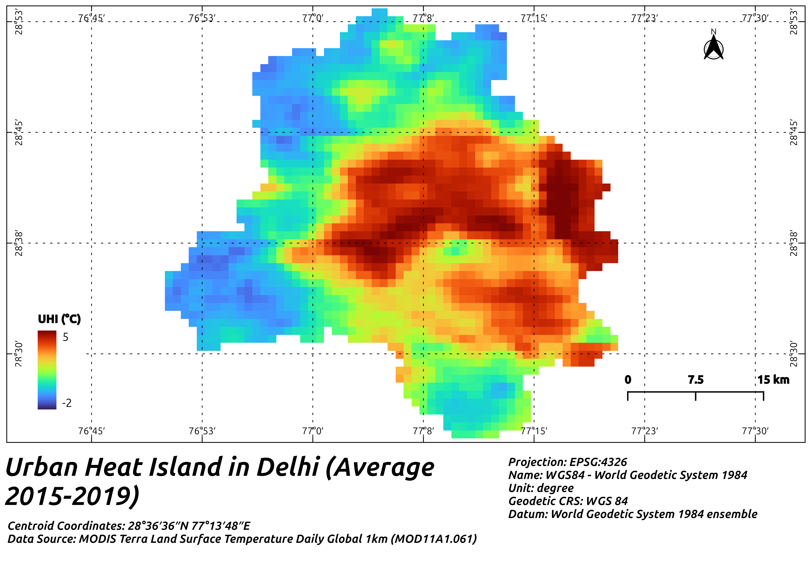

# Surface Heat Island Effect In Delhi
Analysing surface heat island effect in Delhi, India

The Urban Heat Island effect refers to urban areas experiencing higher temperatures than their rural surroundings due to human activities and infrastructure.

## Surface Heat Island Effect wrt Air Pollution

Summer             |  Winter
:-------------------------:|:-------------------------:
  |  
UHI median varying from (2 C to 3.5 C ) in summers.  |  UHI varying from (3.5 degrees to 4.2 C ) in winters.
Greater spread in UHI, especially in 25–50 and 50–75 µg/m³ bins — more variability in heat patterns.  | Spread (IQR) is relatively tight in higher NO₂ bins — suggests more consistent UHI under heavily polluted winter conditions.​
Factors like stronger winds and cloud cover variability in summer might reduce the coupling between air pollution and surface heating.​  |  Possibly due to temperature inversions and stagnant air, pollutants and heat get trapped, especially in dense urban settings.​
